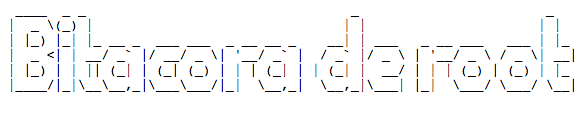

# [Título para Bitácora de root](https://la.bitacoraroot/)

Muestras para el título de nuestro proyecto. Puede ser variable su implementación y/o cambio --- Idea inicial de TeroRERO :smile:.




## Características Especiales:

- Texto original.
- Presentación original.
- En proceso de edición....

## Modelos utilizando distintos tipos de fuente:

```
,---,.            ___                                                                                                                            ___     
,'  .'  \  ,--,   ,--.'|_                                                                  ,---,                                                 ,--.'|_   
,---.' .' |,--.'|   |  | :,'                        ,---.    __  ,-.                       ,---.'|                    __  ,-.   ,---.     ,---.    |  | :,'  
|   |  |: ||  |,    :  : ' :                       '   ,'\ ,' ,'/ /|                       |   | :                  ,' ,'/ /|  '   ,'\   '   ,'\   :  : ' :  
:   :  :  /`--'_  .;__,'  /    ,--.--.     ,---.  /   /   |'  | |' | ,--.--.               |   | |   ,---.          '  | |' | /   /   | /   /   |.;__,'  /   
:   |    ; ,' ,'| |  |   |    /       \   /     \.   ; ,. :|  |   ,'/       \            ,--.__| |  /     \         |  |   ,'.   ; ,. :.   ; ,. :|  |   |    
|   :     \'  | | :__,'| :   .--.  .-. | /    / ''   | |: :'  :  / .--.  .-. |          /   ,'   | /    /  |        '  :  /  '   | |: :'   | |: ::__,'| :    
|   |   . ||  | :   '  : |__  \__\/: . ..    ' / '   | .; :|  | '   \__\/: . .         .   '  /  |.    ' / |        |  | '   '   | .; :'   | .; :  '  : |__  
'   :  '; |'  : |__ |  | '.'| ," .--.; |'   ; :__|   :    |;  : |   ," .--.; |         '   ; |:  |'   ;   /|        ;  : |   |   :    ||   :    |  |  | '.'|
|   |  | ; |  | '.'|;  :    ;/  /  ,.  |'   | '.'|\   \  / |  , ;  /  /  ,.  |         |   | '/  ''   |  / |        |  , ;    \   \  /  \   \  /   ;  :    ;
|   :   /  ;  :    ;|  ,   /;  :   .'   \   :    : `----'   ---'  ;  :   .'   \        |   :    :||   :    |         ---'      `----'    `----'    |  ,   /  
|   | ,'   |  ,   /  ---`-' |  ,     .-./\   \  /                 |  ,     .-./         \   \  /   \   \  /                                         ---`-'   
`----'      ---`-'           `--`---'     `----'                   `--`---'              `----'     `----'                                                   

Font Name: 3D Diagonal
Use FontSelect & Copy

o__ __o      o     o                                                                              o                                                          o     
<|     v\   _<|>_  <|>                                                                            <|>                                                        <|>    
/ \     <\         < >                                                                            < \                                                        < >    
\o/     o/    o     |         o__ __o/      __o__    o__ __o    \o__ __o     o__ __o/        o__ __o/    o__  __o       \o__ __o     o__ __o      o__ __o     |     
|__  _<|    <|>    o__/_    /v     |      />  \    /v     v\    |     |>   /v     |        /v     |    /v      |>       |     |>   /v     v\    /v     v\    o__/_
|       \   / \    |       />     / \   o/        />       <\  / \   < >  />     / \      />     / \  />      //       / \   < >  />       <\  />       <\   |     
<o>      /   \o/    |       \      \o/  <|         \         /  \o/        \      \o/      \      \o/  \o    o/         \o/        \         /  \         /   |     
|      o     |     o        o      |    \\         o       o    |          o      |        o      |    v\  /v __o       |          o       o    o       o    o     
/ \  __/>    / \    <\__     <\__  / \    _\o__</   <\__ __/>   / \         <\__  / \       <\__  / \    <\/> __/>      / \         <\__ __/>    <\__ __/>    <\__  

Font Name: Acrobatic
Use FontSelect & Copy
```
